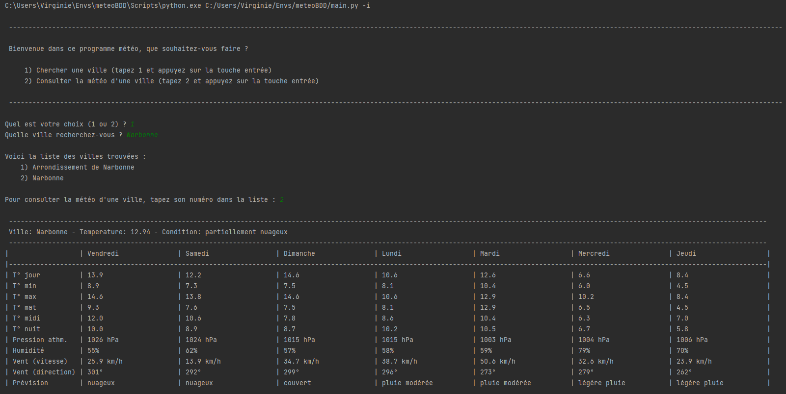

# Application METEO
Projet fil rouge de ma formation : Vivre du code.

- Python
- psycopg2
- pgmodeler
- pgAdmin 4

## Détails
En partant d'un code existant :
- Lire et comprendre le code existant
- Amélioration du choix 1 
- Ajouter un choix 2, devra permettre d'obtenir la météo d'une ville prédéfini
- Ajouter eu choix 3, devra permettre l'affichage d'un 'Le saviez-vous ?', qui donnera une astuce / info sur la météo en général
- Modification de la taille de l'image météo (plus petit)
- Ajouter de la couleur à l'application
- Mettre en lien avec une base de données
- Ajout d'un fichier, backup.py pour gérér les sauvegardes
- Ajout d'un fichier restore.py pour gérer la restauration de données
- Refactoriser le code en Programmation Orienté Objet

## pgModeler
- Après le changement d'un champ, source -> copié à partir de CREATE TABLE 
(pas besoin de CREATE ROLE et CREATE DATABASE) 
- collé dans le projet / 00_create_tables.sql
- Lancer generate.py (automatisation)

## En cours
- Le choix 1, après avoir obtenu la météo d'une ville, l'utilisateur doit pouvoir demander 
la météo pour une autre ville et décider lui même de sortir du programme.

## Aperçu

